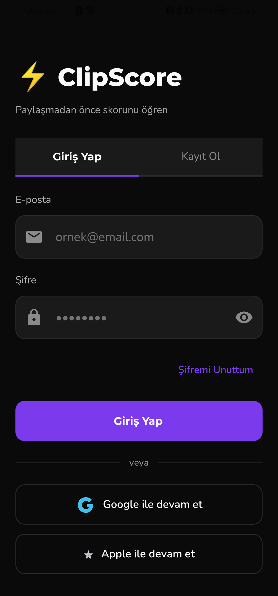
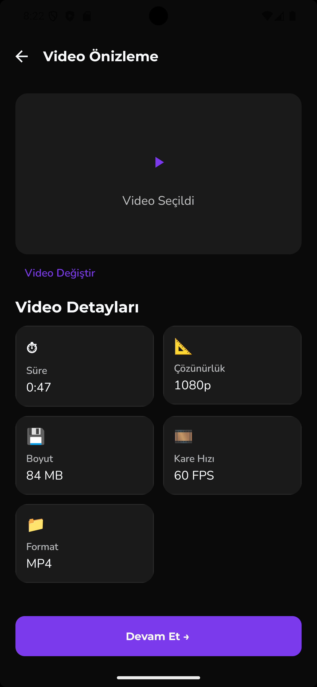
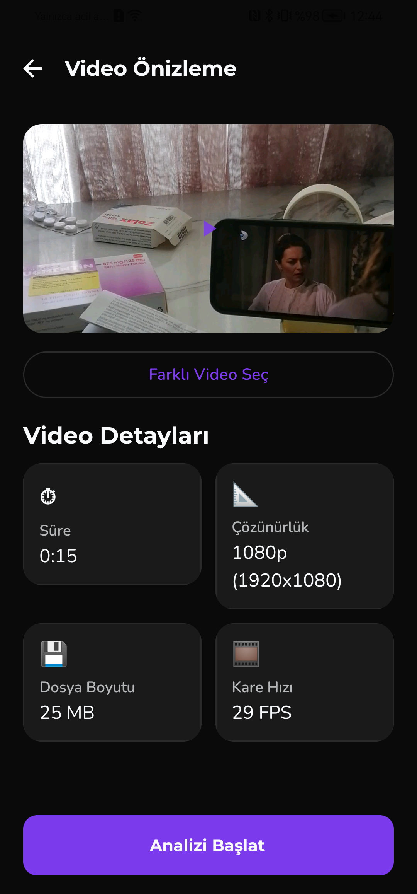
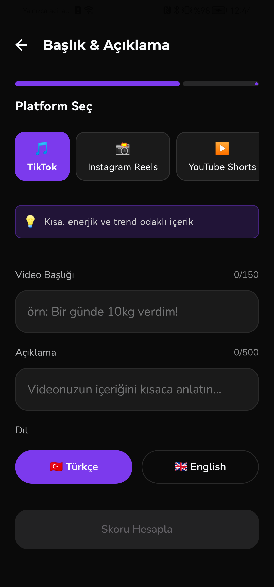
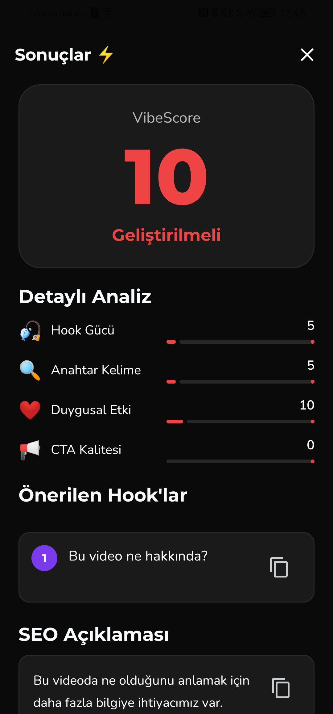

<div align="center">

# ⚡ ClipScore

### *Paylaşmadan önce skorunu öğren*

**YouTube Shorts, TikTok ve Instagram Reels içerik üreticileri için AI destekli ön-yayın analiz uygulaması.**

Video başlığı ve açıklamanı gir → AI viral potansiyelini 0-100 arası puanlar → 3 hook cümlesi + SEO açıklaması üretir.

[](https://android.com)
[](https://kotlinlang.org)
[](https://flask.palletsprojects.com)
[](https://render.com)

</div>

---

## 📱 Ekran Görüntüleri

### Giriş & Kayıt

<div align="center">
<table>
  <tr>
    <td align="center">
      
      <br/><b>Splash Ekranı</b>
    </td>
    <td align="center">
      
      <br/><b>Giriş Yap</b>
    </td>
    <td align="center">
      
      <br/><b>Kayıt Ol</b>
    </td>
  </tr>
</table>
</div>

> E-posta/şifre ile klasik kayıt ve Google ile tek tıkla giriş desteği.

---

### Ana Sayfa

<div align="center">
<table>
  <tr>
    <td align="center">
      
      <br/><b>Ana Sayfa (boş)</b>
    </td>
    <td align="center">
      
      <br/><b>Son Analizler</b>
    </td>
  </tr>
</table>
</div>

> Geçmiş analizler platforma göre emoji ve renk kodlu skor ile listelenir. Her analiz tıklanabilir.

---

### Analiz Sayfası

<div align="center">
<table>
  <tr>
    <td align="center">
      
      <br/><b>Video Seç</b>
    </td>
    <td align="center">
      
      <br/><b>Video Önizleme</b>
    </td>
    <td align="center">
      
      <br/><b>Video Detayları</b>
    </td>
  </tr>
</table>
</div>

<div align="center">
<table>
  <tr>
    <td align="center">
      
      <br/><b>Platform Seç + Başlık (boş)</b>
    </td>
    <td align="center">
      
      <br/><b>Platform Seç + Başlık (dolu)</b>
    </td>
    <td align="center">
      
      <br/><b>AI Analiz Ediyor...</b>
    </td>
  </tr>
</table>
</div>

> Galeriden video seçilir → metadata (süre, çözünürlük, boyut, FPS) otomatik çıkarılır → Platform (TikTok, Instagram Reels, YouTube Shorts) seçilir → Başlık ve açıklama girilir → AI analiz başlar.

---

### Sonuç & Detay Sayfası

<div align="center">
<table>
  <tr>
    <td align="center">
      
      <br/><b>Analiz Sonucu</b>
    </td>
    <td align="center">
      
      <br/><b>Sonuç Detayı</b>
    </td>
    <td align="center">
      
      <br/><b>Hook & SEO Önerileri</b>
    </td>
  </tr>
</table>
</div>

> VibeScore gauge animasyonu, Hook Gücü / Anahtar Kelime / Duygusal Etki / CTA Kalitesi breakdown kartları, 3 adet kopyalanabilir hook cümlesi, SEO açıklaması ve hashtag listesi.

---

## 🚀 Özellikler

| Özellik | Açıklama |
|---|---|
| 🎯 **AI Viral Skoru** | 0-100 arası VibeScore ile içeriğinin potansiyelini öğren |
| 🎣 **Hook Önerileri** | Platforma özel 3 dikkat çekici başlangıç cümlesi |
| 🔍 **SEO Açıklaması** | Platform algoritmasına uygun optimize edilmiş açıklama |
| #️⃣ **Hashtag Paketi** | Platforma göre 5 adet trend hashtag |
| 📊 **Detaylı Analiz** | Hook Gücü, Anahtar Kelime, Duygusal Etki, CTA skorları |
| 📱 **Platform Desteği** | TikTok, Instagram Reels, YouTube Shorts, YouTube, X (Twitter) |
| 🎬 **Video Metadata** | Süre, çözünürlük, boyut, FPS otomatik çıkarımı |
| 📂 **Analiz Geçmişi** | Son 10 analiz kullanıcıya özel kaydedilir |
| 🔐 **Auth** | E-posta/şifre + Google ile giriş |
| 🌍 **Çok Dil** | Türkçe & İngilizce analiz desteği |

---

## 🏗️ Mimari

```
Kullanıcı
    ↓
Android (Kotlin + Jetpack Compose)
    ↓  Retrofit / OkHttp
Backend (Python / Flask) — Render.com
    ↓  Gemini API
Gemini AI 
```

```
clipscore/
├── app/                    # Android modülü
│   └── src/main/java/
│       ├── ui/screen/      # Compose ekranları
│       ├── ui/viewmodel/   # ViewModel'lar
│       ├── data/           # Room DB, Repository
│       └── navigation/     # NavGraph
├── backend/                # Flask API
│   ├── main.py
│   └── requirements.txt
└── prodocs/                # Dokümanlar & görseller
```

---

## ⚙️ Kurulum

### Backend

```bash
cd backend
pip install -r requirements.txt
cp .env.example .env
# .env dosyasına ANTHROPIC_API_KEY ekle
python main.py
```

### Android

1. Android Studio'da proje kökünü aç
2. `local.properties` dosyasına backend URL'yi ekle:

```properties
# Emülatör için:
BACKEND_URL=http://10.0.2.2:5000/

# Gerçek cihaz veya production için:
BACKEND_URL=https://clipscore-dmmb.onrender.com/
```

3. **Run → Run 'app'**

### Ortam Değişkenleri

```env
# backend/.env
GEMINI_API_KEY=sk-ant-...
PORT=5000
```

---

## 🌐 Deploy

Backend **Render.com** üzerinde çalışmaktadır:

🔗 `https://clipscore-dmmb.onrender.com`

> ⚠️ Free plan kullanıldığından ilk istek 30-60 saniye sürebilir (backend uyanma süresi).

---

## 🛠️ Teknoloji Yığını

### Android
- **Kotlin** + **Jetpack Compose** + **Material 3**
- **MVVM** + **StateFlow** mimari pattern
- **Retrofit** + **OkHttp** — HTTP istemcisi
- **Room** — Yerel analiz geçmişi
- **Firebase Auth** — Kimlik doğrulama
- **Hilt** — Dependency injection

### Backend
- **Python 3.11** + **Flask** + **Gunicorn**
- **GEMINI API** — AI analiz motoru
- **Flask-CORS** — Cross-origin desteği

---

## 📄 Lisans

MIT License — özgürce kullanabilir, fork edebilirsin.

---

<div align="center">

**⚡ ClipScore** — *İçerik üreticileri için, içerik üreticileri tarafından.*

</div>
