<div align="center">

# ⚡ ClipScore

### *Paylaşmadan önce skorunu öğren*

**YouTube Shorts, TikTok ve Instagram Reels içerik üreticileri için AI destekli ön-yayın analiz uygulaması.**

Video yükle → Platform seç → AI viral potansiyelini 0-100 arası puanlar → Video içeriğini görsel olarak analiz eder → 3 hook cümlesi + SEO açıklaması üretir.

[](https://android.com)
[](https://kotlinlang.org)
[](https://flask.palletsprojects.com)
[](https://ai.google.dev)
[](https://render.com)
[](https://firebase.google.com)

</div>

---

## 📱 Ekran Görüntüleri

### Giriş & Kayıt

<div align="center">
<table>
  <tr>
    <td align="center">
      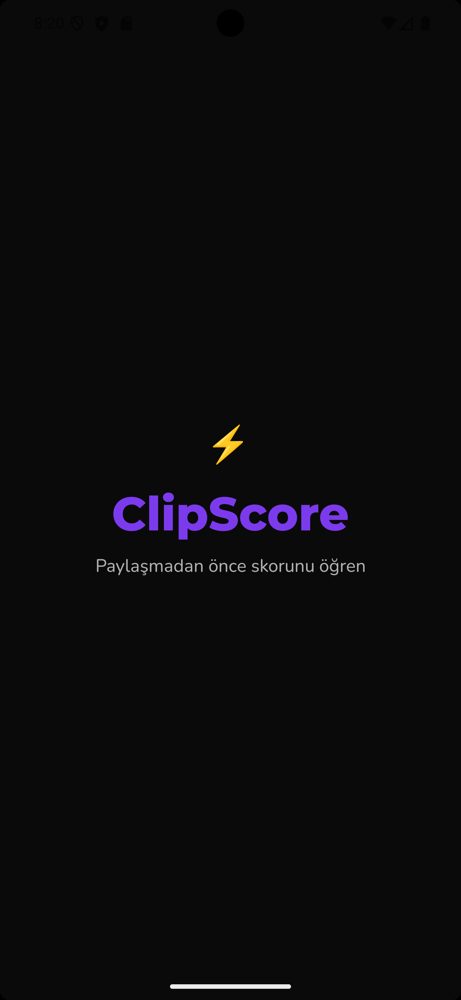
      <br/><b>Splash Ekranı</b>
    </td>
    <td align="center">
      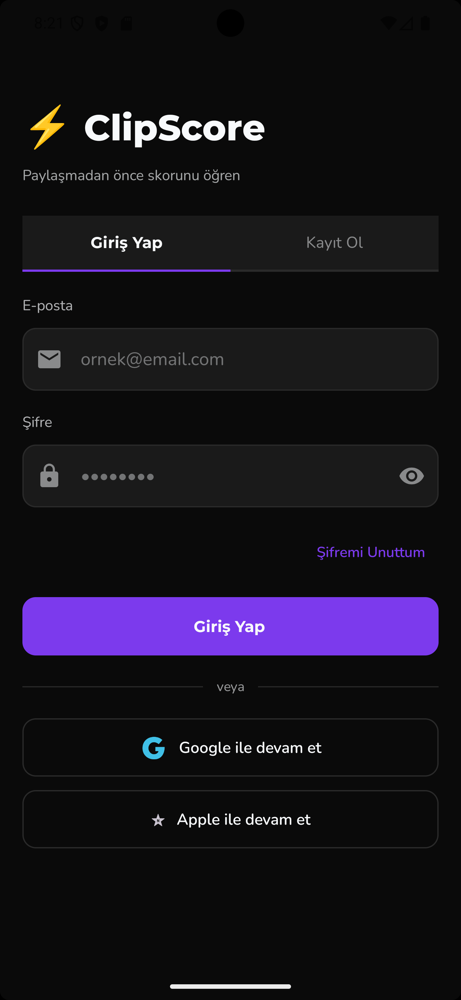
      <br/><b>Giriş Yap</b>
    </td>
    <td align="center">
      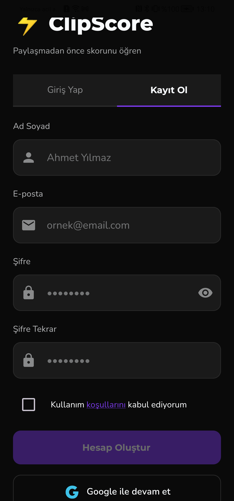
      <br/><b>Kayıt Ol</b>
    </td>
  </tr>
</table>
</div>

> Ad soyad, e-posta ve şifre ile kayıt — kullanım koşulları onayı ile. Google ile tek tıkla giriş desteği. Firebase Authentication altyapısı.

---

### Ana Sayfa

<div align="center">
<table>
  <tr>
    <td align="center">
      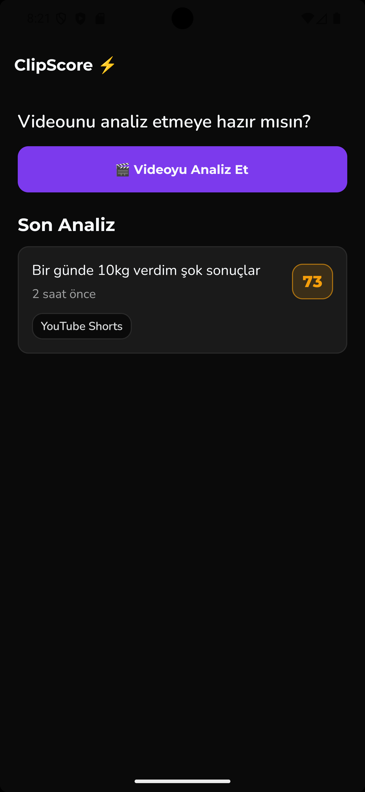
      <br/><b>Ana Sayfa (boş)</b>
    </td>
    <td align="center">
      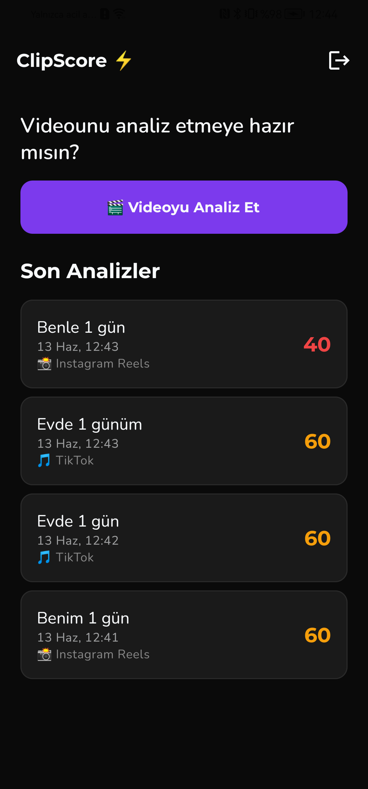
      <br/><b>Son Analizler</b>
    </td>
  </tr>
</table>
</div>

> Geçmiş analizler platforma göre emoji ve renk kodlu skor ile listelenir. Kırmızı düşük, sarı orta, yeşil iyi performans. Her analiz tıklanabilir — detay sayfasına gider.

---

### Analiz Akışı

<div align="center">
<table>
  <tr>
    <td align="center">
      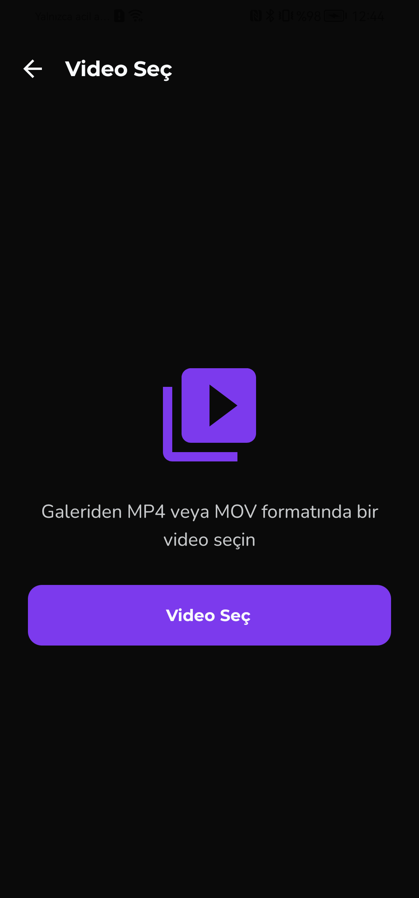
      <br/><b>1. Video Seç</b>
    </td>
    <td align="center">
      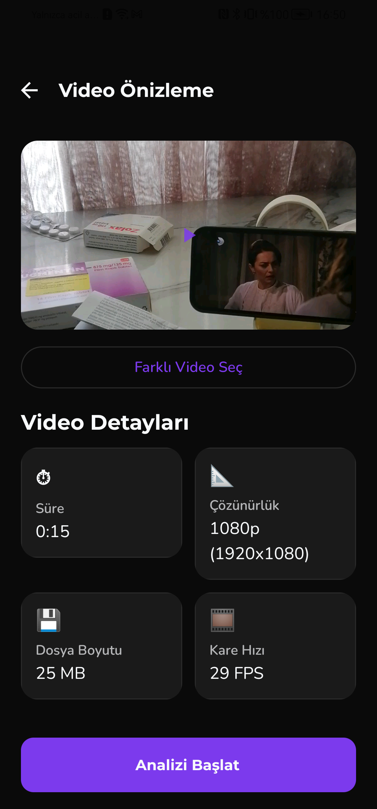
      <br/><b>2. Video Önizleme</b>
    </td>
    </td>
  </tr>
</table>
</div>

<div align="center">
<table>
  <tr>
    <td align="center">
      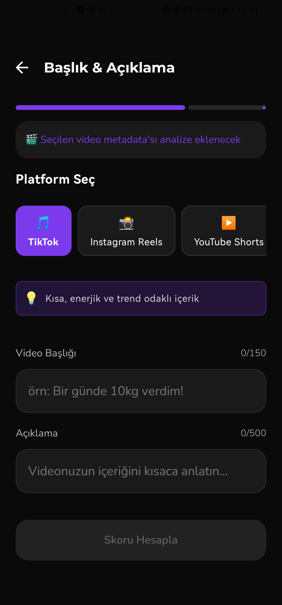
      <br/><b>4. Platform Seç</b>
    </td>
    <td align="center">
      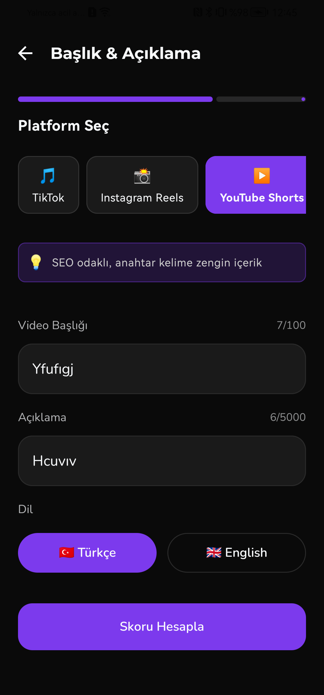
      <br/><b>5. Başlık Gir</b>
    </td>
    <td align="center">
      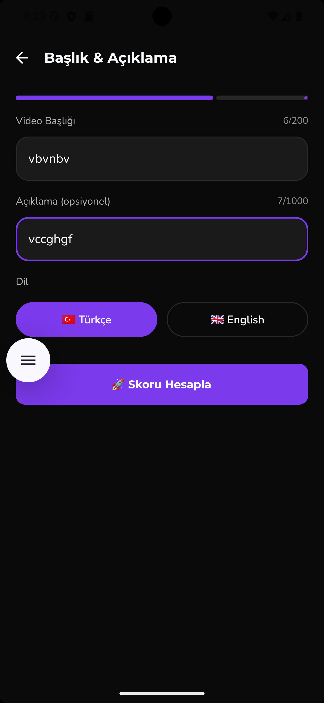
      <br/><b>6. AI Analiz Ediyor</b>
    </td>
  </tr>
</table>
</div>

> **Adım adım akış:** Galeriden video seçilir → Süre, çözünürlük, boyut, FPS otomatik çıkarılır → Platform seçilir (her platformun karakter limiti ve ipucu dinamik güncellenir) → Başlık ve açıklama girilir → AI analiz başlar.

---

### Sonuç & Detay Sayfası

<div align="center">
<table>
  <tr>
    <td align="center">
      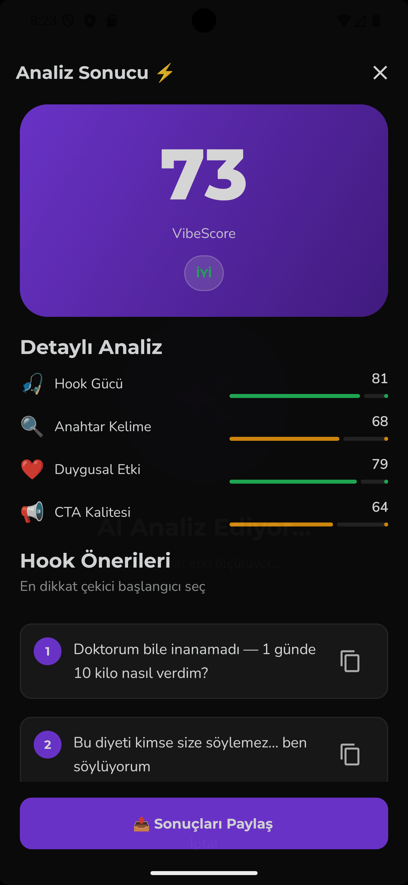
      <br/><b>Analiz Sonucu</b>
    </td>
    <td align="center">
      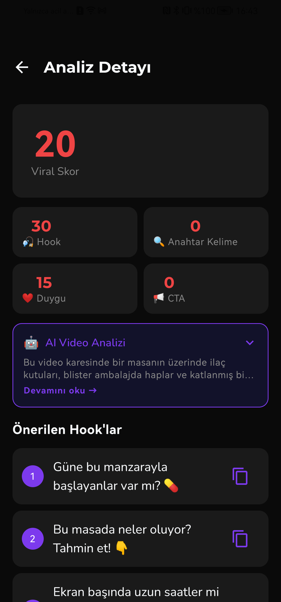
      <br/><b>Detay + AI Video Analizi</b>
    </td>
    <td align="center">
      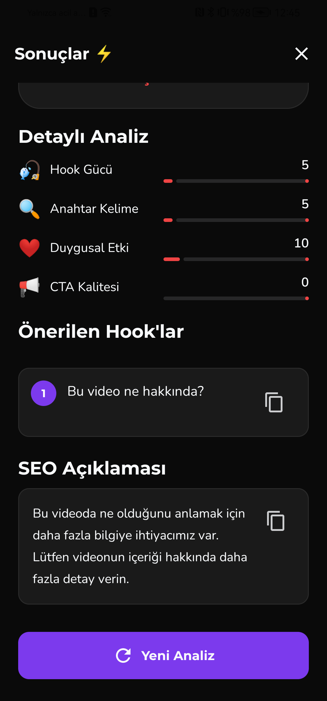
      <br/><b>Hook & SEO Önerileri</b>
    </td>
  </tr>
</table>
</div>

> **VibeScore** + Hook Gücü / Anahtar Kelime / Duygusal Etki / CTA Kalitesi / **İçerik Uyumu** breakdown kartları. **🤖 AI Video Analizi** kartı tıklanınca genişler — Gemini'nin video karesinden ne gördüğünü açıklar. 3 kopyalanabilir hook, SEO açıklaması ve hashtag paketi.

---

## 🚀 Özellikler

| Özellik | Açıklama |
|---|---|
| 🎯 **AI Viral Skoru** | 0-100 arası VibeScore ile içeriğinin potansiyelini öğren |
| 🤖 **AI Video Görme** | Gemini Vision video karesini görsel olarak analiz eder |
| 🎬 **İçerik Uyumu** | Başlığın video içeriğiyle uyum skoru |
| 🎣 **Hook Önerileri** | Platforma özel 3 dikkat çekici başlangıç cümlesi |
| 🔍 **SEO Açıklaması** | Platform algoritmasına uygun optimize edilmiş açıklama |
| #️⃣ **Hashtag Paketi** | Platforma göre 5 adet trend hashtag |
| 📊 **Detaylı Analiz** | Hook Gücü, Anahtar Kelime, Duygusal Etki, CTA skorları |
| 📱 **5 Platform** | TikTok, Instagram Reels, YouTube Shorts, YouTube, X (Twitter) |
| 🎞️ **Video Metadata** | Süre, çözünürlük, boyut, FPS otomatik çıkarımı |
| 📂 **Analiz Geçmişi** | Son 10 analiz kullanıcıya özel Room DB'de saklanır |
| 🔐 **Auth** | Ad soyad + e-posta/şifre kayıt & Google ile giriş |
| 🔔 **Snackbar Bildirimler** | Hata, başarı ve kopyalama bildirimleri animasyonlu |

---

## 🏗️ Mimari

```
Kullanıcı
    ↓
Android (Kotlin + Jetpack Compose)
    ↓  Retrofit / OkHttp
Backend (Python / Flask) — Render.com
    ↓                    ↓
Gemini Vision API    Gemini Text API
(Video frame analiz)  (Skor & hook üretimi)
```

```
clipscore/
├── app/                         # Android modülü
│   └── src/main/java/
│       ├── ui/screen/           # Compose ekranları
│       │   ├── AuthScreen.kt
│       │   ├── HomeScreen.kt
│       │   ├── VideoPickerScreen.kt
│       │   ├── VideoPreviewScreen.kt
│       │   ├── TitleInputScreen.kt
│       │   ├── ResultScreen.kt
│       │   └── AnalysisDetailScreen.kt
│       ├── ui/viewmodel/        # ViewModel'lar
│       ├── data/                # Room DB, Entity, DAO
│       └── navigation/          # NavGraph
├── backend/                     # Flask API
│   ├── main.py
│   ├── requirements.txt
│   └── Procfile
└── prodocs/                     # Dokümanlar & görseller
```

---

## ⚙️ Kurulum

### Backend

```bash
cd backend
pip install -r requirements.txt
cp .env.example .env
# .env dosyasına GEMINI_API_KEY ekle
python main.py
```

### Android

1. Android Studio'da proje kökünü aç
2. `google-services.json` dosyasını `app/` klasörüne koy (Firebase Console'dan indir)
3. `local.properties` dosyasına backend URL'yi ekle:

```properties
# Emülatör için:
BACKEND_URL=http://10.0.2.2:5000/

# Gerçek cihaz veya production için:
BACKEND_URL=https://clipscore-dmmb.onrender.com/
```

4. **Run → Run 'app'**

### Ortam Değişkenleri

```env
# backend/.env
GEMINI_API_KEY=AIza...
PORT=5000
```

---

## 🌐 Deploy

Backend **Render.com** üzerinde çalışmaktadır:

🔗 `https://clipscore-dmmb.onrender.com`

> ⚠️ Free plan kullanıldığından ilk istek 30-60 saniye sürebilir (backend uyanma süresi). Uygulama bunu otomatik retry mekanizmasıyla yönetir.

---

## 🛠️ Teknoloji Yığını

### Android
- **Kotlin** + **Jetpack Compose** + **Material 3**
- **MVVM** + **StateFlow** mimari pattern
- **Retrofit** + **OkHttp** — HTTP istemcisi (retry interceptor dahil)
- **Room** — Kullanıcıya özel yerel analiz geçmişi
- **Firebase Auth** — E-posta/şifre + Google ile kimlik doğrulama
- **MediaMetadataRetriever** — Video metadata & frame çıkarımı

### Backend
- **Python 3.11** + **Flask** + **Gunicorn**
- **Google Gemini Vision API** — Video kare görsel analizi
- **Google Gemini Text API** — Skor, hook ve SEO üretimi
- **Pillow** — Görüntü işleme
- **Flask-CORS** — Cross-origin desteği

---

## 📄 Lisans

MIT License — özgürce kullanabilir, fork edebilirsin.

---

<div align="center">

**⚡ ClipScore** — *İçerik üreticileri için, içerik üreticileri tarafından.*

</div>
